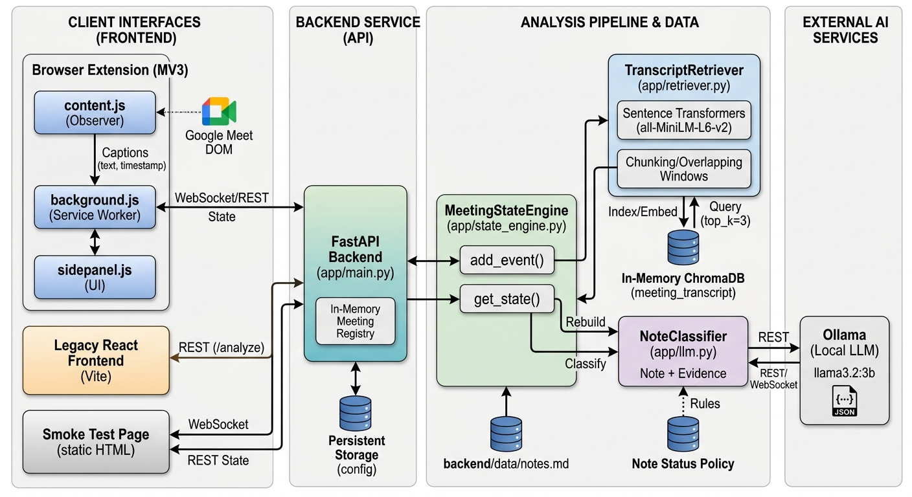

# Meeting Proxy

Meeting Proxy is a local AI meeting assistant that watches live Google Meet
captions, compares them with a list of meeting notes, and reports which notes
are open, partially addressed, or completed.

The main experience is a Manifest V3 browser extension. It captures finalized
captions from Google Meet, sends them to a local FastAPI backend, and displays
the evolving note status in a sidebar. A local Ollama model and semantic
retrieval pipeline provide the evidence used for each classification.

## High-Level Architecture



The system is organized into four areas:

- **Client interfaces:** the Google Meet browser extension, the legacy React
  frontend, and the static WebSocket smoke-test page.
- **Backend service:** FastAPI receives transcript events, manages meeting
  state, and exposes REST and WebSocket endpoints.
- **Analysis pipeline:** transcript events are chunked and embedded by
  `TranscriptRetriever`, stored in in-memory ChromaDB, and matched to notes.
- **External AI service:** local Ollama runs `llama3.2:3b` and returns a
  structured note classification.

## What It Does

1. Meeting notes are loaded from `backend/data/notes.md`.
2. The extension observes Google Meet caption changes and waits for a caption
   to stabilize before sending it as a timestamped event.
3. The backend appends each event to the active meeting transcript.
4. The transcript is re-indexed and the most relevant evidence is retrieved
   for each unfinished note.
5. Ollama classifies each eligible note as `open`, `partial`, or `completed`.
6. Note status is monotonic: it can move from `open` to `partial` to
   `completed`, but it never regresses. Completed notes are frozen and skip
   later LLM calls.
7. The updated meeting state is sent back to the extension sidebar.

## Requirements

- Windows with PowerShell
- Python 3.14 or a compatible Python environment
- Node.js and npm, if using the legacy React frontend
- A Chromium-based browser such as Chrome or Opera
- Google Meet with captions enabled, if using the browser extension
- Ollama with the `llama3.2:3b` model
- GPU/CUDA is recommended for faster local model execution, but CPU may work

The repository includes a virtual environment in `meet_proxy/`. The checked-in
`backend/requirements.txt` is currently empty, so use an environment that
already contains FastAPI, Uvicorn, ChromaDB, Sentence Transformers, Ollama,
Pydantic, and their dependencies.

## Setup

### 1. Prepare Ollama

Install Ollama, start its local service, and download the configured model:

```powershell
ollama pull llama3.2:3b
ollama list
```

### 2. Start the Backend

From the repository root:

```powershell
.\meet_proxy\Scripts\Activate.ps1
cd .\backend
python -m uvicorn app.main:app --reload
```

The API runs at `http://127.0.0.1:8000`.

### 3. Load the Browser Extension

1. Open `chrome://extensions` or the equivalent extensions page.
2. Enable **Developer mode**.
3. Select **Load unpacked**.
4. Choose the repository's `extension/` directory.
5. Open Google Meet and enable captions.
6. Open the Meeting Proxy sidebar and select **Start meeting**.

The extension uses these local defaults:

- REST backend: `http://127.0.0.1:8000`
- WebSocket backend: `ws://127.0.0.1:8000`

It starts a backend meeting, opens a WebSocket, forwards stabilized captions,
and renders updated note state. The service worker reconnects with exponential
backoff if the WebSocket closes.

## Other Ways to Run It

### Static Streaming Smoke Test

With the backend running, open:

`http://127.0.0.1:8000/static/test.html`

This page can start and end meetings, send manual or canned transcript events,
refresh state through REST, and display raw meeting state.

### Legacy React Frontend

The React frontend still uses the batch `/analyze` endpoint. It reads the
sample transcript from `backend/data/transcript.txt` and does not use the live
WebSocket workflow.

```powershell
cd .\frontend
npm install
npm run dev
```

Open the Vite URL, usually `http://localhost:5173`. Additional checks are:

```powershell
npm run lint
npm run build
npm run preview
```

## API Overview

### Start a meeting

```http
POST /meeting/start
```

Returns a `MeetingState` containing a generated `meeting_id`, an empty
transcript, and notes initialized to `open`.

### Send an event

```http
POST /meeting/{meeting_id}/event
Content-Type: application/json
```

```json
{
  "timestamp": "00:14",
  "speaker": "Alice",
  "text": "Agreed, let's use PostgreSQL."
}
```

The response contains the updated transcript and note results. The WebSocket
equivalent is:

```text
ws://127.0.0.1:8000/meeting/{meeting_id}/ws
```

Send the same event with `"type": "event"` over the WebSocket. The server
also accepts `{"type":"ping"}` and replies with `{"type":"pong"}`.

### Read or end a meeting

```http
GET  /meeting/{meeting_id}/state
POST /meeting/{meeting_id}/end
DELETE /meeting/{meeting_id}
```

Flat convenience routes are also available at `/meeting/state`,
`/meeting/end`, and `/meeting/event` for the newest meeting.

## Repository Layout

```text
meeting_proxy/
|-- backend/       FastAPI service, analysis pipeline, notes, and test page
|-- extension/     Manifest V3 Google Meet caption client and sidebar
|-- frontend/      Legacy React/Vite batch-analysis UI
|-- examples/      Voice examples and the high-level architecture image
|-- meet_proxy/    Local Python virtual environment
|-- readme.md      Project overview and setup guide
|-- understandingFiles_readme.md
|                  Detailed implementation and file-reference documentation
```

Important runtime files include:

- `backend/app/main.py`: FastAPI routes, meeting registry, and WebSocket
  handling.
- `backend/app/state_engine.py`: event processing and monotonic note updates.
- `backend/app/retriever.py`: transcript chunking, embeddings, and ChromaDB
  search.
- `backend/app/llm.py`: Ollama prompt and structured response validation.
- `extension/content.js`: Google Meet caption observer.
- `extension/background.js`: backend session and WebSocket relay.
- `extension/sidepanel.js`: live note-state UI.

## Limitations

- Meeting state and ChromaDB data are held in memory and are lost when the
  backend exits.
- Each new event re-indexes the full transcript; unfinished notes may still
  trigger another LLM call.
- The extension depends on Google Meet caption DOM selectors that may change.
- There is no authentication, multi-user persistence, or speech-to-text
  service outside Google Meet captions.
- The React frontend is a legacy batch client and is separate from the live
  extension workflow.