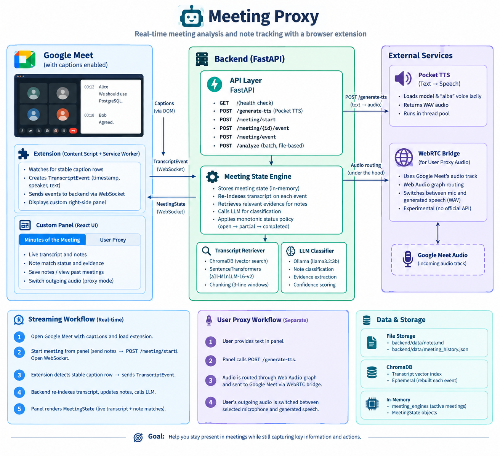

# Meeting Proxy

Meeting Proxy is a local AI meeting assistant that watches live Google Meet
captions, compares them with a list of meeting notes, and reports which notes
are open, partially addressed, or completed.

The main experience is a Manifest V3 browser extension. It captures finalized
Google Meet captions and displays the live transcript and note status in a
custom panel. The panel separates meeting notes from **User Proxy**, which can
mix Meet's microphone with generated Pocket TTS speech at the same time. Its
independent microphone and TTS volume sliders range from muted to full volume
and default to 100% when the mix is enabled. The User Proxy also generates
transcript-grounded question suggestions and observes the live conversation to
propose replies. Proposed replies are shown for approval; they are sent to Meet
only when the user selects **Speak response**. Ollama and semantic retrieval
provide evidence for note classification.

Caption updates are sent as newly added text rather than replaying the full
growing caption row. For unanswered technical questions, the proxy checks the
local profile and relevant Markdown/text notes first, then may silently query
DuckDuckGo for technical documentation or benchmark snippets when local context
is insufficient. Personal opinions and internal project decisions are never
web-searched. Only a sanitized technical query is sent to the search provider,
not the profile, task list, or complete transcript.

## High-Level Architecture



The system is organized into four areas:

- **Client interfaces:** the Google Meet browser extension, the legacy React
  frontend, and the static WebSocket smoke-test page.
- **Backend service:** FastAPI receives transcript events, keeps note analysis
  separate from conversational state, and provides Pocket TTS audio.
- **Analysis pipeline:** transcript events are chunked and embedded by
  `TranscriptRetriever`, stored in in-memory ChromaDB, and matched to notes.
- **External AI service:** local Ollama runs `llama3.2:3b` and returns
  structured note classifications, suggested questions, and transcript-driven
  conversational decisions, reply proposals, and explicit task-memory updates.

## What It Does

1. Open the extension panel and optionally enter or upload one note per line.
2. Start a meeting. The extension observes Google Meet caption changes and waits for a caption
   to stabilize before sending it as a timestamped event.
3. The backend appends each event to the active meeting transcript.
4. The transcript is re-indexed and the most relevant evidence is retrieved
   for each unfinished note.
5. Ollama classifies each eligible note as `open`, `partial`, or `completed`.
6. Note status is monotonic: it can move from `open` to `partial` to
   `completed`, but it never regresses. Completed notes are frozen and skip
   later LLM calls.
7. The updated meeting state is sent back to the extension panel.
8. In **User Proxy**, the proxy observes transcript updates, decides whether a
  reply is needed, and displays proposed replies in a local overlay on the
  Meet page. Nothing is spoken automatically; select **Approve and speak** or
  press `Ctrl/Cmd+Enter` to approve, or press `Escape` to discard.

The profile task list is also updated in the background when a caption clearly
assigns a task to the user or explicitly changes one of their task statuses.
Only explicit assignments and progress statements are applied; generic group
requests are not assigned to the user.

When there is no active meeting state, the notes editor loads the default list
from `backend/data/notes.md`; users can replace it before starting. Saving
notes writes the list to `backend/data/notes.md` and updates the active meeting
immediately. The panel also supports saved-meeting review, including the
captured transcript and final note matches.

The **User settings** tab stores the participant's name, background, and tasks
with their statuses in the local backend at `backend/data/user_profile.json`.
The conversational proxy uses this profile when preparing future reply
suggestions, including updates made during an active meeting. It is intended
for local use with the local backend and Ollama.

## Requirements

- Windows with PowerShell
- Python 3.14 or a compatible Python environment
- Node.js and npm, if using the legacy React frontend
- A browser that supports the extension's Manifest V3 APIs and content scripts
- Google Meet with captions enabled, if using the browser extension
- Ollama with the `llama3.2:3b` model
- GPU/CUDA is recommended for faster local model execution, but CPU may work

The repository includes a virtual environment in `meet_proxy/`. The checked-in
`backend/requirements.txt` is currently empty, so use an environment that
already contains FastAPI, Uvicorn, ChromaDB, Sentence Transformers, Ollama,
Pydantic, Pocket TTS, PyTorch, SciPy, and their dependencies.

## Setup

### 1. Prepare Ollama

Install Ollama, start its local service, and download the configured model:

```powershell
ollama pull llama3.2:3b
ollama list
```

### 2. Start the Backend

From the repository root:

```powershell
.\meet_proxy\Scripts\Activate.ps1
cd .\backend
python -m uvicorn app.main:app --reload
```

The API runs at `http://127.0.0.1:8000`.

### 3. Load the Browser Extension

1. Open `chrome://extensions` or the equivalent extensions page.
2. Enable **Developer mode**.
3. Select **Load unpacked**.
4. Choose the repository's `extension/` directory.
5. Open Google Meet and enable captions.
6. Click the Meeting Proxy extension action to open the custom panel on the
  right side of the Google Meet tab.
7. In **Minutes of the Meeting**, optionally enter notes or upload a
  `.txt`/`.md` file, then select **Start meeting**. Use **User Proxy** to
  converse with the transcript-aware proxy or select and speak one of the
  suggested questions. Enable the audio mix to send both microphone and TTS to
  Meet, then adjust their independent volume sliders as needed.

The extension uses these local defaults:

- REST backend: `http://127.0.0.1:8000`
- WebSocket backend: `ws://127.0.0.1:8000`

The panel is injected into Google Meet by the content script and does not rely
on Chrome's `side_panel` or Opera's `sidebar_action` APIs. It starts a backend
meeting, opens a WebSocket, forwards stabilized captions, renders the live
transcript and updated note state, and reconnects with exponential backoff if
the WebSocket closes.

## Other Ways to Run It

### Static Streaming Smoke Test

With the backend running, open:

`http://127.0.0.1:8000/static/test.html`

This page can start and end meetings, send manual or canned transcript events,
refresh state through REST, and display raw meeting state. **Load demo
transcript** supplies fake captions for the conversational proxy to evaluate.
Review any proposed text and select **Speak approved response** to preview its
TTS audio. Select **Interrupt** while the proxy is evaluating the transcript to
test cancellation.

The fake-client regression tests can be run from the repository root:

```powershell
.\meet_proxy\Scripts\python.exe -m unittest discover -s backend -p test_duplex_llm.py -v
```

### Legacy React Frontend

The React frontend still uses the batch `/analyze` endpoint. It reads the
sample transcript from `backend/data/transcript.txt` and does not use the live
WebSocket workflow.

### Text-to-Speech

`POST /generate-tts` accepts `{"text":"Hello!"}` and returns WAV bytes as
`audio/wav`. The extension uses this response in the User Proxy tab.

```powershell
cd .\frontend
npm install
npm run dev
```

Open the Vite URL, usually `http://localhost:5173`. Additional checks are:

```powershell
npm run lint
npm run build
npm run preview
```

## API Overview

### Start a meeting

```http
POST /meeting/start
```

Optionally provide custom notes. An empty list starts a meeting with no notes;
omitting the body uses the default `backend/data/notes.md` list.

```json
{
  "notes": [
    "Confirm the launch date",
    "Assign the follow-up owner"
  ]
}
```

Returns a `MeetingState` containing a generated `meeting_id`, an empty
transcript, and notes initialized to `open`.

### Send an event

```http
POST /meeting/{meeting_id}/event
Content-Type: application/json
```

```json
{
  "timestamp": "00:14",
  "speaker": "Alice",
  "text": "Agreed, let's use PostgreSQL."
}
```

The response contains the updated transcript and note results. The WebSocket
equivalent is:

```text
ws://127.0.0.1:8000/meeting/{meeting_id}/ws
```

Send the same event with `"type": "event"` over the WebSocket. The server
also accepts `{"type":"ping"}` and replies with `{"type":"pong"}`.

### Read or end a meeting

```http
GET  /meeting/{meeting_id}/state
POST /meeting/{meeting_id}/end
DELETE /meeting/{meeting_id}
```

### Suggest questions

```http
POST /meeting/{meeting_id}/questions
```

Uses the meeting's transcript so far and local Ollama to return exactly three
concise questions as `{"questions": ["...", "...", "..."]}`. The User Proxy
requests suggestions when opened and refreshes them after new transcript
events while the tab is visible. Suggestions use the saved participant profile
and only captions from other speakers; if only the participant's own captions
are available, the endpoint asks the client to wait for other participants
instead of generating self-directed questions.

### Draft approval

Completed reply proposals appear in a private floating overlay over the local
Google Meet page. Use **Approve and speak** or `Ctrl/Cmd+Enter` to send the
approved draft as TTS; use **Discard** or `Escape` to dismiss it. The overlay is
rendered by the extension content script and is not part of the meeting video
or visible to other participants.

Flat convenience routes are also available at `/meeting/state`,
`/meeting/end`, and `/meeting/event` for the newest meeting.

### Manage notes and meeting history

```http
GET /notes/default
PUT /notes/default
PUT /meeting/{meeting_id}/notes
GET /meetings
GET /meetings/{meeting_id}
```

`PUT /notes/default` rewrites `backend/data/notes.md` from a JSON note list.
`PUT /meeting/{meeting_id}/notes` updates the active meeting immediately;
unchanged notes retain their analysis, new notes start as `open`, and removed
notes are removed. `GET /meetings` lists saved meetings newest first, while
`GET /meetings/{meeting_id}` returns the saved transcript and note state.

### Manage the participant profile

```http
GET /user-profile
PUT /user-profile
Content-Type: application/json
```

The profile contains a name, background, and task list. Each task status is
`not_started`, `in_progress`, or `completed`. The backend saves this data
locally in `backend/data/user_profile.json`; updates are available to the proxy
for future response suggestions, including during an active meeting.

```json
{
  "name": "Jordan Lee",
  "background": "Product lead for the mobile launch.",
  "tasks": [
    {"title": "Confirm launch date", "status": "in_progress"},
    {"title": "Send release notes", "status": "not_started"}
  ]
}
```

## Repository Layout

```text
meeting_proxy/
|-- backend/       FastAPI service, analysis pipeline, notes, and test page
|-- extension/     Manifest V3 Google Meet caption client and custom panel
|-- frontend/      Legacy React/Vite batch-analysis UI
|-- examples/      Voice examples and the detailed architecture image
|-- meet_proxy/    Local Python virtual environment
|-- readme.md      Project overview and setup guide
|-- understandingFiles_readme.md
|                  Detailed implementation and file-reference documentation
```

Important runtime files include:

- `backend/app/main.py`: FastAPI routes, meeting registry, and WebSocket
  handling, note updates, and meeting history persistence.
- `backend/app/state_engine.py`: event processing and monotonic note updates.
- `backend/app/retriever.py`: transcript chunking, embeddings, and ChromaDB
  search.
- `backend/app/llm.py`: Ollama prompts and structured response validation for
  note classifications and question suggestions.
- `extension/content.js`: Google Meet caption observer.
- `extension/background.js`: backend session and WebSocket relay.
- `extension/meet_audio_bridge.js`: experimental Meet outgoing-audio bridge.
- `extension/sidepanel.js`: live transcript, note-state, editing, and history UI.
- `backend/data/user_profile.json`: local participant profile and task context,
  created when a profile is first saved.
- `backend/data/notes.md`: default note list, updated by the panel's Save notes
  action.
- `backend/data/meeting_history.json`: persisted meeting snapshots and UTC
  timestamps for review.

## Limitations

- The active meeting registry and ChromaDB data are held in memory. Meeting
  snapshots are also written to `backend/data/meeting_history.json`, but an
  active meeting cannot be resumed after the backend exits.
- The custom panel only appears on Google Meet tabs where the content script is
  allowed to run; clicking the extension action on another page does nothing.
- The JSON history file is local storage, not a database, and has no
  authentication or multi-user concurrency controls.
- Each new event re-indexes the full transcript; unfinished notes may still
  trigger another LLM call.
- The extension depends on Google Meet caption DOM selectors that may change.
- User Proxy replaces Meet's WebRTC audio sender through an experimental
  page-world bridge; Google Meet provides no supported extension API for this,
  so compatibility requires live testing and may change with Meet updates.
- There is no authentication, multi-user persistence, or speech-to-text
  service outside Google Meet captions.
- The React frontend is a legacy batch client and is separate from the live
  extension workflow.